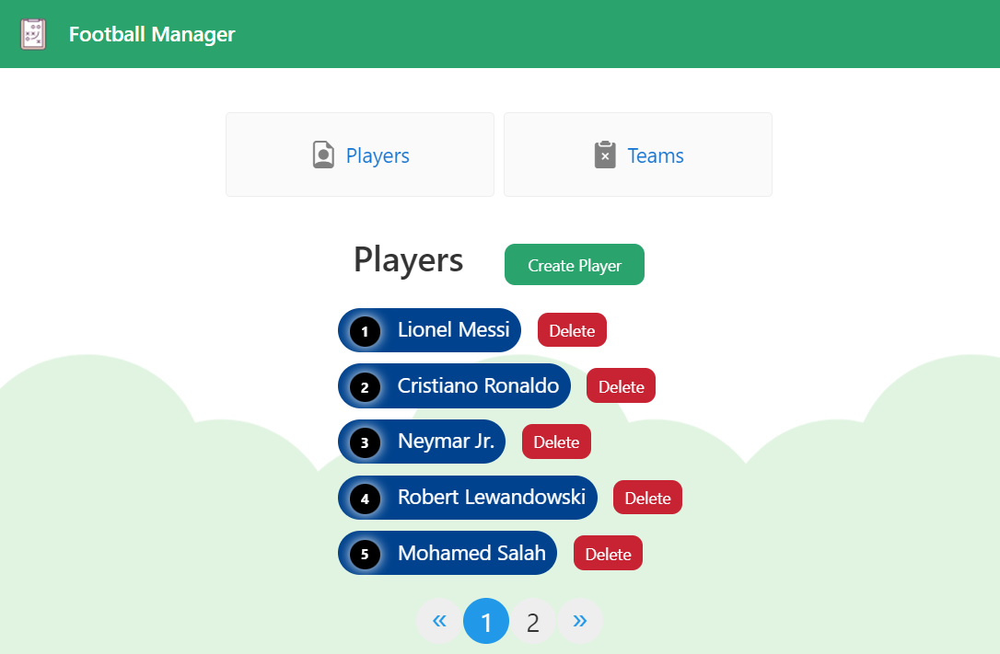
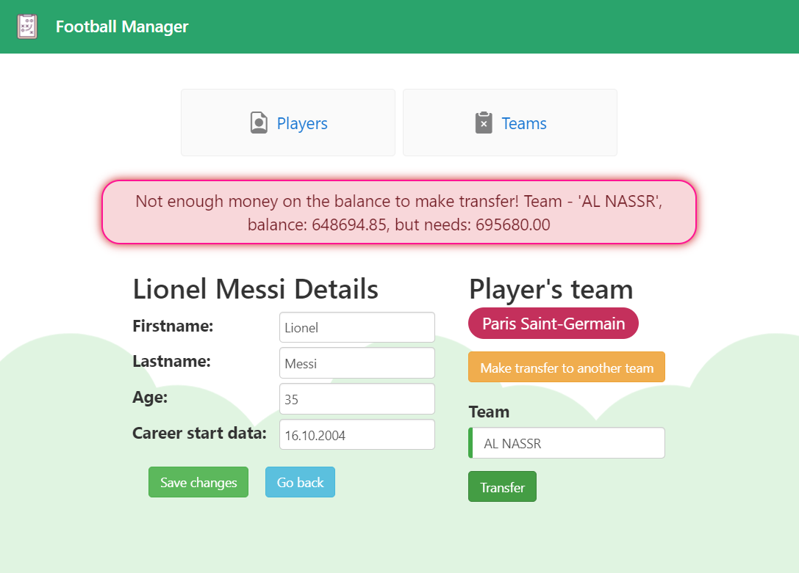
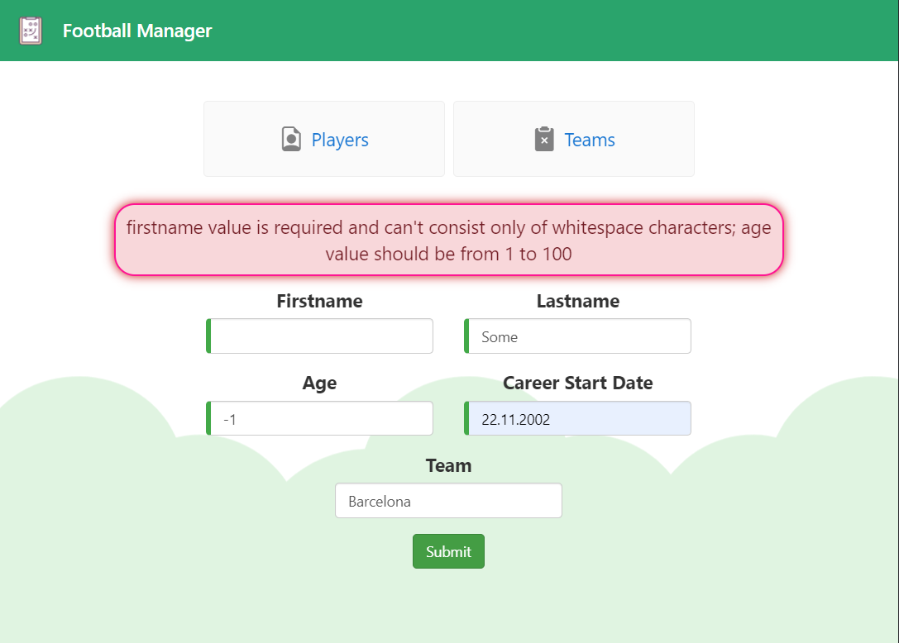
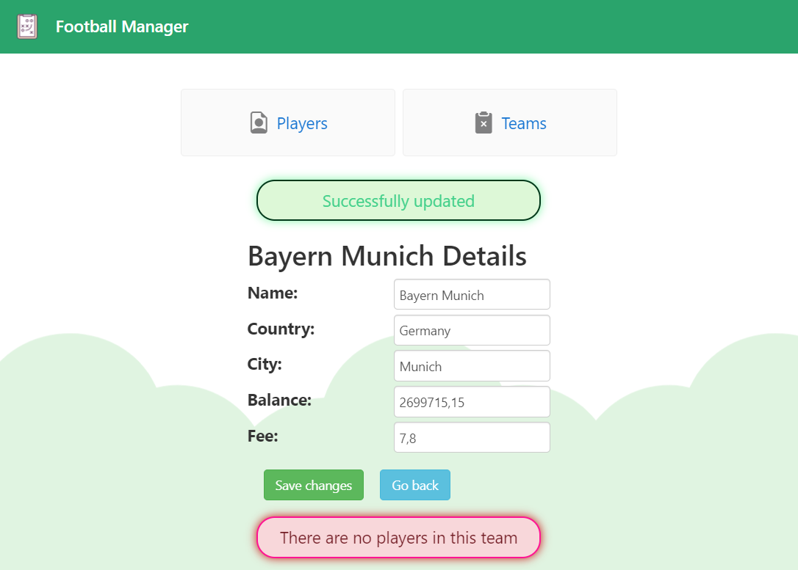

# Football Manager

## 📌 About 
This project was created for educational purposes, to familiarize with how backend and frontend development work together. 
Football Manager provides an opportunity to create and manage players and teams, edit information and make player transfer 
from one team to another. On the backend side is implemented a RESTful API (Java, Spring Boot) with a connection to MySql RDBMS. 
On the frontend side - SPA (Angular) for displaying data.

## ⚡ How to run 
+ Ensure you have installed Docker Desktop and MySql
+ Set your configuration in files (database settings like USER and PASSWORD + if you want you can change URL to db and ports values):
  + `football-manager-api\src\main\resources\application.properties` (**spring.datasource.username** and **spring.datasource.password** is *REQUIRED*)
  + `.env` (**MYSQLDB_USER**, **MYSQLDB_ROOT_PASSWORD** is *REQUIRED*)
+ Run next command in terminal from `football-manager-api` directory:
  > mvn clean package
+ Run next command in terminal from the main directory:
  > docker-compose up
+ Open your browser on http://localhost:4200

:anger: If you have problems with 'node_modules' while building:
  + try to install dependencies locally: run `npm install` command in terminal from `frontend` directory
  + before executing the `docker-compose up` command again - delete the previously installed `football-manager-frontend` image

## 🛠️ Used technologies
+ JDK 17
+ Apache Maven 3.8.1
+ Spring Boot 3.1.1
+ Hibernate 6.2.4
+ MySQL 8.0.32
+ Liquibase 4.20.0
+ NodeJS 18.16.0
+ npm 9.5.1
+ Angular CLI 16.1.0
+ Bootstrap 3.3.7
+ Mapstruct 1.5.5.Final
+ Lombok 1.18.20
+ Docker 23.0.5

## 📋 [Postman Collection](https://www.postman.com/denysmg/workspace/fm-app/collection/27152854-025e298e-48f5-4835-a578-0231fd294a47?action=share&creator=27152854)

## 👀 Project overview

